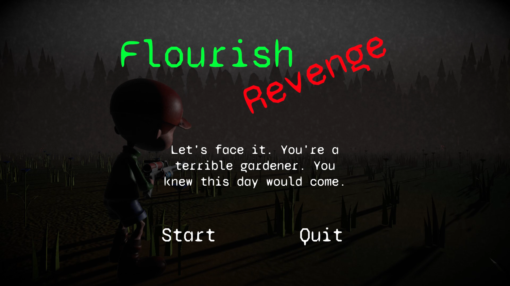
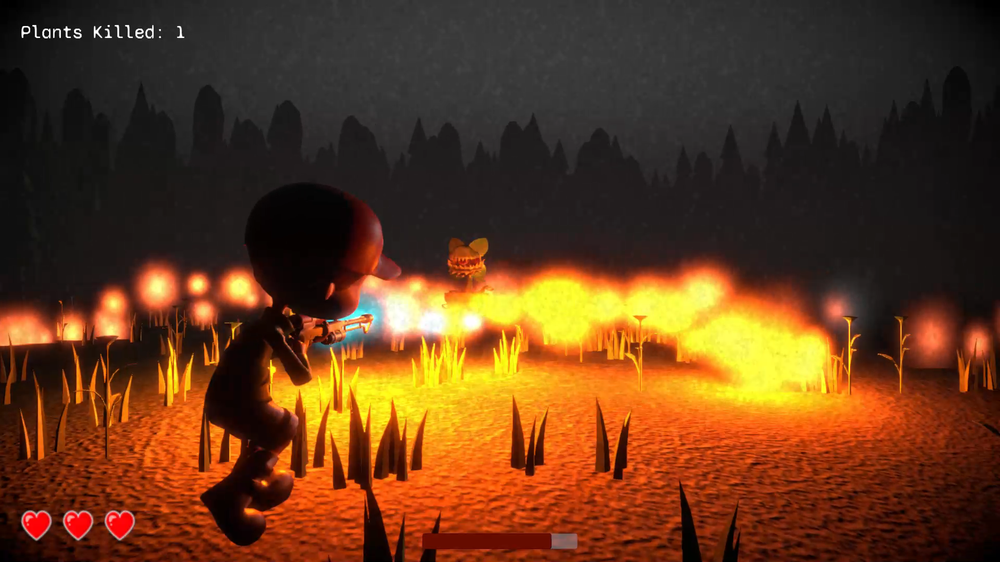
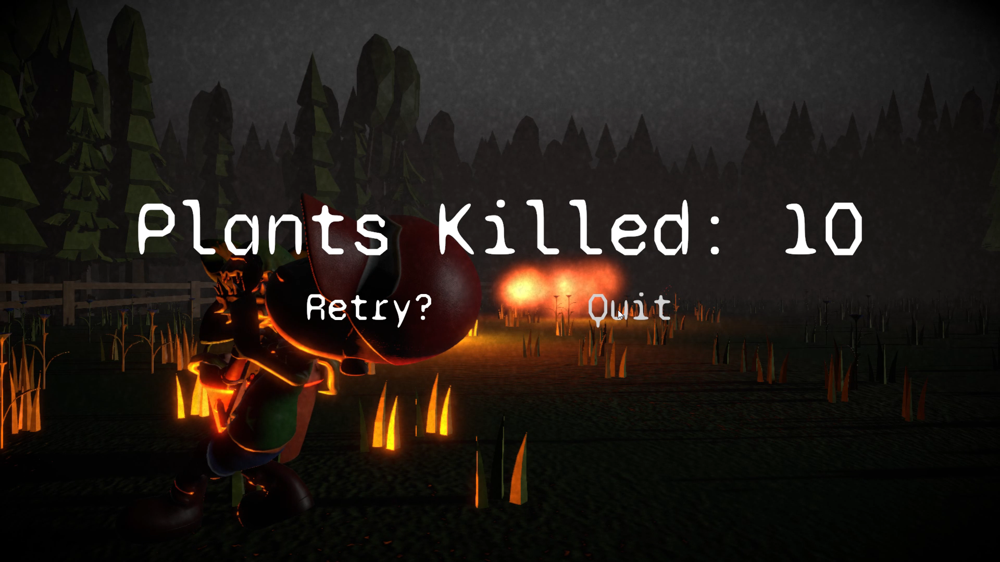

# Flourish - Revenge

Game Jam project for Game Dev Field Guide Game Jam #3 (March 2021).  This was also my first completed 3D game project!

Game is available for download at https://brianpmaher.itch.io/flourish-revenge

I was not able to make my main Unity project public because I did a poor job of separating assets that I can't distribute from the rest of my project, so the majority of my Unity project for this game is in a private repository.  I did create some assets in that project that I'd love to share, like animations and visual effects, but it's too tangled in with assets I pulled in to be worth breaking that all out.  I did want to provide the scripts I wrote so that I could point to them later to maybe help others or be able to show I approached some of the problems I encountered.  I'll do a better job organizing future game dev projects so that it can be more easily shared.

This code is definitely hacky and I took several different approaches to the same problems through the development of this game jam game, but I figured I'd leave it all as is so that I can show what I tried and what I thought worked well and what didn't.  I used this project as a learning opportunity to try to figure out some patterns for managing my game UI with Unity MonoBehaviours.  Some of the approaches I took I liked, others I didn't.  I'm still not sure I settled on a good approach, but I'll do some investigation in prototypes going forward so that my game code doesn't become so unmanageable with varying approaches.

# Screenshots

